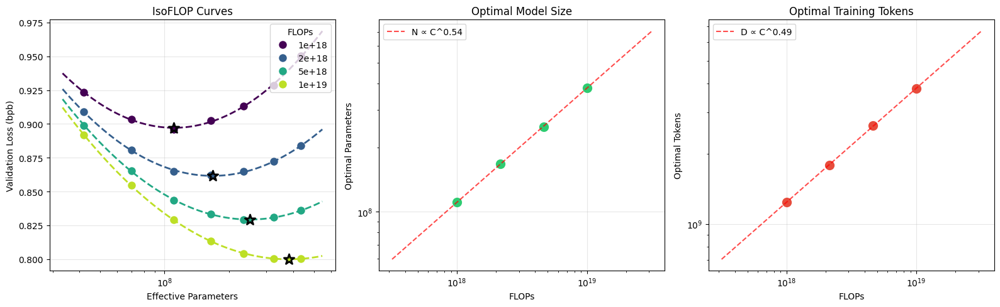

[English](README.md) | [日本語](README.ja.md)

# nanochat




> **C++ 移植版について** — このリポジトリには依存ライブラリなしの C++17 移植版
> ([`cpp/`](cpp/)) が含まれます。モデル・Muon・BPE・KV cache 推論に加え、SFT と
> 電卓ツール付きの chat まで CPU 上・依存なしで動きます。詳しくは
> [`cpp/README.ja.md`](cpp/README.ja.md) を参照してください。

nanochat は LLM を学習するための最もシンプルな実験ハーネスです。単一の GPU ノードで動くよう
設計され、コードは最小限で改造しやすく、トークナイズ・事前学習・ファインチューニング・評価・
推論という LLM の主要な段階をすべてカバーします。例えば、2019 年には約 43,000 ドルかかった
GPT-2 級の LLM を、わずか 48 ドル（8×H100 GPU ノードの約2時間）で自分で学習し、シンプルな CLI で
対話できます。スポットインスタンスなら総額はおよそ 15 ドルに近づきます。より一般的には、
nanochat は「複雑さのダイヤル」を1つ設定するだけ — GPT Transformer の層数 `--depth` — で、
計算最適なモデルのミニシリーズ全体をそのまま学習するよう構成されています（GPT-2 級はおよそ
depth 26 に相当）。その他のハイパーパラメータ（Transformer の幅、ヘッド数、学習率の調整、
学習ホライズン、weight decay …）はすべて自動で最適に計算されます。

リポジトリに関する質問は、Devin/Cognition の [DeepWiki](https://deepwiki.com/karpathy/nanochat)、
[Discussions タブ](https://github.com/karpathy/nanochat/discussions)、または Discord の
[#nanochat](https://discord.com/channels/1020383067459821711/1427295580895314031) チャンネルを
おすすめします。

## Time-to-GPT-2 リーダーボード

現在の開発の主眼は、最も計算を要する事前学習段階のチューニングです。modded-nanogpt に触発され、
進歩とコミュニティ協力を促すため、nanochat は「GPT-2 speedrun」のリーダーボードを維持しています。
これは DCLM CORE スコアで測って GPT-2 級の能力に達するまでに要する実時間です。
[runs/speedrun.sh](runs/speedrun.sh) は常に GPT-2 級モデルを学習して対話するための基準手順を
反映しています。現在のリーダーボードは次のとおり:

| # | time | val_bpb | CORE | Description | Date | Commit | Contributors |
|---|-------------|---------|------|-------------|------|--------|--------------|
| 0 | 168 hours | - | 0.2565 | Original OpenAI GPT-2 checkpoint | 2019 | - | OpenAI |
| 1 | 3.04 | 0.74833 | 0.2585 | d24 baseline, slightly overtrained | Jan 29 2026 | 348fbb3 | @karpathy |
| 2 | 2.91 | 0.74504 | 0.2578 | d26 slightly undertrained **+fp8** | Feb 2 2026 | a67eba3 | @karpathy |
| 3 | 2.76 | 0.74645 | 0.2602 | bump total batch size to 1M tokens | Feb 5 2026 | 2c062aa | @karpathy |
| 4 | 2.02 | 0.71854 | 0.2571 | change dataset to NVIDIA ClimbMix | Mar 4 2026 | 324e69c | @ddudek @karpathy |
| 5 | 1.80 | 0.71808 | 0.2690 | autoresearch [round 1](https://x.com/karpathy/status/2031135152349524125) | Mar 9 2026 | 6ed7d1d | @karpathy |
| 6 | 1.65 | 0.71800 | 0.2626 | autoresearch round 2 | Mar 14 2026 | a825e63 | @karpathy |

私たちが重視する主要指標は "time to GPT-2" — 8×H100 GPU ノードで GPT-2 (1.6B) の CORE 指標を
上回るのに必要な実時間です。GPT-2 の CORE スコアは 0.256525。2019 年には GPT-2 の学習に約
43,000 ドルかかったので、7 年間のスタック全体にわたる多くの進歩により、今やはるかに速く、
100 ドルを大きく下回って実現できるのは驚異的です（例: 現在の約 $3/GPU/時 なら 8×H100 ノードは
約 $24/時 で、2 時間で約 $48）。

リーダーボードの読み方や貢献方法の詳細は [dev/LEADERBOARD.md](dev/LEADERBOARD.md) を参照。

## はじめに

### セットアップ

nanochat は依存管理に [uv](https://docs.astral.sh/uv/) を使います。インストール:

```bash
uv sync --extra gpu    # CUDA 用（A100/H100 等）
uv sync --extra cpu    # （または）CPU のみ / MPS 用
source .venv/bin/activate
```

開発用（pytest・matplotlib・ipykernel・transformers 等を追加）:

```bash
uv sync --extra gpu --group dev
```

### GPT-2 を再現して対話する

最も楽しいのは、自分の GPT-2 を学習して対話することです。そのための全パイプラインは単一ファイル
[runs/speedrun.sh](runs/speedrun.sh) に収められており、8×H100 GPU ノードで実行する想定です。
好みのプロバイダ（例えば私は [Lambda](https://lambda.ai/service/gpu-cloud) を愛用）で新しい
8×H100 ボックスを立ち上げ、学習スクリプトを起動します:

```bash
bash runs/speedrun.sh
```

約1.5時間かかるので screen セッション内で実行するとよいでしょう。完了したら CLI でモデルと
対話できます。ローカルの uv 仮想環境が有効なことを確認して（`source .venv/bin/activate`）、
チャット:

```bash
python -m scripts.chat_cli
```

物語や詩を書かせたり、あなたが誰かを尋ねて幻覚を見たり、空が青い（あるいは緑の）理由を
聞いてみましょう。speedrun は 4e19 FLOPs の能力モデルなので、幼稚園児と話す感覚です :)。
speedrun モデルとの会話例:

> **User:** Hello whats up?
>
> **Assistant:** Hello! How can I help you today?
>
> **User:** Why is the sky blue?
>
> **Assistant:** The sky is blue due to an optical illusion called the Rayleigh Scattering of Light, which occurs when sunlight passes through tiny particles in the air. These particles are made up of tiny blue and violet particles that cause the light to bend in a particular way.
>
> **User:** That's cool. Write a poem about it.
>
> **Assistant:** In the twilight's glow, the sky is blue,<br>
> A canvas of shimmering blue, where skies unfold,<br>
> ...

いくつか補足:

- Ampere の 8×A100 GPU ノードでも問題なく動きます（少し遅い）。
- `torchrun` を省けば単一 GPU でも問題なく動き、ほぼ同一の結果になります（自動で勾配累積に
  切り替わる）。ただし 8 倍の時間がかかります。
- GPU が 80GB 未満だと一部のハイパーパラメータを調整しないと OOM / VRAM 不足になります。
  スクリプト内の `--device-batch-size` を探し、収まるまで下げてください（例: 32 → 16, 8, 4, 2, 1）。
- コードの大半はごく普通の PyTorch なので、それをサポートするもの（xpu, mps 等）で動くはずですが、
  すべての経路を私が動かしたわけではないので粗い部分があるかもしれません。

## リサーチ

nanochat の改善を手伝いたい研究者の方は、[runs/scaling_laws.sh](runs/scaling_laws.sh) と
[runs/miniseries.sh](runs/miniseries.sh) の2つのスクリプトが参考になります。関連ドキュメントは
[Jan 7 miniseries v1](https://github.com/karpathy/nanochat/discussions/420) を参照。素早い実験
（約5分の事前学習）には、12 層モデル（GPT-1 サイズ）の学習が私のお気に入りのスケールです:

```
OMP_NUM_THREADS=1 torchrun --standalone --nproc_per_node=8 -m scripts.base_train -- \
    --depth=12 \
    --run="d12" \
    --model-tag="d12" \
    --core-metric-every=999999 \
    --sample-every=-1 \
    --save-every=-1 \
```

重要なのは、nanochat が「複雑さのダイヤル」1つ — Transformer の depth — を中心に書かれ構成されて
いる点です。この整数1つが他のすべてのハイパーパラメータを自動決定し、学習されたモデルが計算最適に
出てきます。ユーザーは `--depth` で小さい/大きいモデルを要求するだけで、あとは「勝手に動く」の
です。depth をスイープすれば、様々なサイズの計算最適モデルのミニシリーズが得られます。

## CPU / MPS で動かす

[runs/runcpu.sh](runs/runcpu.sh) は CPU や Apple Silicon で動かすごく簡単な例です。数十分の学習に
収まるよう、学習する LLM を大幅に縮小します。この方法では強い結果は得られません。

## 精度 / dtype

nanochat は `torch.amp.autocast` を使いません。代わりに、単一のグローバル `COMPUTE_DTYPE`
（`nanochat/common.py` で定義）で精度を明示的に管理します。デフォルトはハードウェアに応じて
自動検出されます:

| ハードウェア | 既定 dtype | 理由 |
|----------|--------------|-----|
| CUDA SM 80+ (A100, H100, ...) | `bfloat16` | ネイティブ bf16 テンソルコア |
| CUDA SM < 80 (V100, T4, ...) | `float32` | bf16 無し。fp16 は `NANOCHAT_DTYPE=float16` で（GradScaler 使用） |
| CPU / MPS | `float32` | 安全な既定。最近の macOS では MPS で `NANOCHAT_DTYPE=bfloat16` も動く |

`NANOCHAT_DTYPE` 環境変数で既定を上書きできます:

```bash
NANOCHAT_DTYPE=float32 python -m scripts.chat_cli -p "hello"   # fp32 を強制
NANOCHAT_DTYPE=bfloat16 torchrun --nproc_per_node=8 -m scripts.base_train  # bf16 を強制
```

仕組み: モデルの重みは fp32 で保持し（オプティマイザ精度のため）、独自の `Linear` 層が forward 時に
`COMPUTE_DTYPE` へキャストします。埋め込みはメモリ節約のため `COMPUTE_DTYPE` で直接保持します。
これにより autocast と同じ混合精度の利点を、どの精度で何を実行するかを完全に明示制御しつつ
得られます。

## ガイド

役立つ情報を含むガイドをいくつか公開しています（新しい順）:

- [Feb 1 2026: Beating GPT-2 for <<$100: the nanochat journey](https://github.com/karpathy/nanochat/discussions/481)
- [Jan 7 miniseries v1](https://github.com/karpathy/nanochat/discussions/420)
- [Guide: counting r in strawberry (and how to add abilities generally)](https://github.com/karpathy/nanochat/discussions/164)
- [Oct 13 2025: original nanochat post](https://github.com/karpathy/nanochat/discussions/1)

## ファイル構成

（英語版 [README.md](README.md) のツリーを参照。`nanochat/` パッケージ・`scripts/`・`tasks/`・
`runs/`・`tests/`、そして依存なしの C++ 移植版 [`cpp/`](cpp/) を含みます。）

## 貢献

nanochat の目標は、1000 ドル未満の予算でエンドツーエンドに扱えるマイクロモデルの最先端を
改善することです。アクセシビリティは総コストだけでなく認知的な複雑さの問題でもあります。
nanochat は網羅的に設定可能な LLM「フレームワーク」ではありません。巨大な設定オブジェクトも、
モデルファクトリも、if-then-else の怪物もありません。単一の・まとまった・最小限で・読みやすく・
改造しやすく・最大限フォークしやすい「強いベースライン」コードベースで、最初から最後まで動かして
対話できる ChatGPT モデルを生み出すよう設計されています。

現在の AI ポリシー: 開示。PR を提出する際は、LLM の実質的な寄与があり、自分で書いていない、
あるいは完全には理解していない部分を申告してください。

## 謝辞

- 名前（nanochat）は、事前学習のみをカバーしていた私の以前のプロジェクト
  [nanoGPT](https://github.com/karpathy/nanoGPT) に由来します。
- nanochat は [modded-nanoGPT](https://github.com/KellerJordan/modded-nanogpt) にも触発されており、
  事前学習の多くのアイデアと一部実装を借用しています。
- fineweb と smoltalk を提供してくれた [HuggingFace](https://huggingface.co/) に感謝。
- 本プロジェクト開発の計算資源を提供してくれた [Lambda](https://lambda.ai/service/gpu-cloud) に感謝。
- 最高の LLM ウィスパラー 🧙‍♂️ Alec Radford の助言に感謝。
- issue・PR・discussion の管理を手伝ってくれた repo czar の Sofie
  [@svlandeg](https://github.com/svlandeg) に感謝。

## 引用

研究で nanochat が役立った場合は、次のように引用してください:

```bibtex
@misc{nanochat,
  author = {Andrej Karpathy},
  title = {nanochat: The best ChatGPT that \$100 can buy},
  year = {2025},
  publisher = {GitHub},
  url = {https://github.com/karpathy/nanochat}
}
```

## ライセンス

MIT
